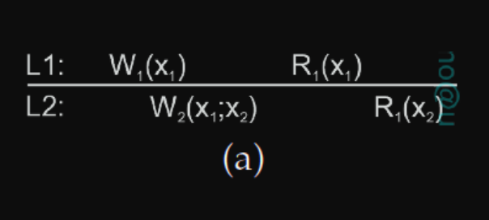
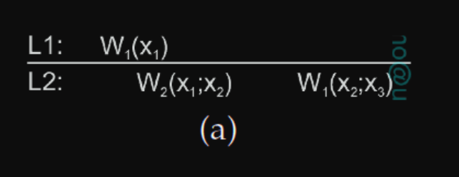
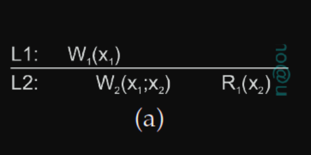
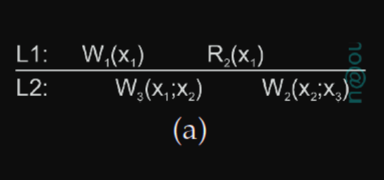

# Unidade 07 - Consistência e Replicação

A _replicação de dados_ é realizada para aumentar a disponibilidade e o desempenho de um sistema distribuído. No entanto, a replicação pode introduzir problemas de _consistência_, pois as cópias dos dados precisam ser mantidas consistentes. Sol. comum: relaxar restrições de consistência

---

DATA-CENTRIC CONSISTENCY MODELS: fornecem uma visão consistente do data store para todos os processos do sistema.

- **_Data store_**: armazenamento de dados distribuído em que operações de leitura e escrita são realizadas

**Consistência Sequencial:** as operações de read e write em dados são percebidas como se tivessem ocorrido em uma ordem sequencial. Ordem das operações não importa, desde que a ordem seja a mesma em todos o processos. Não há referência ao tempo ou à operação de write mais recente; _a mesma sequência em um P deve ser vista no outro P_

Data store sequencialmente consistente: o resultado de qualquer execução é o mesmo como se as operações (read e write) sobre o data store, realizadas por todos os processos distribuídos, fossem executadas na mesma ordem por todos os processos igualmente.

- _Fig 7-8. Porque a ordem das operações (c-b e b-c) difere entre os processos P3 e P4._

**Consistência Causal:** versão mais fraca da consistência sequencial, que leva em consideração a causalidade entre eventos. Eventos que são potencialmente relacionados causalmente devem ser percebidos na mesma ordem por todos os processos. Operações concorrentes em dados não relacionados causalmente podem ser percebidas em ordens diferentes por diferentes processos.

- Se evento **b** é causado ou influenciado por um evento anterior **a**, causalidade requer que todos vejam primeiro **a**, e depois **b.**
- _Fig 7-9. Porque dado que o valor do item x foi alterado para “b” depois da sua leitura como “a”, não é possível que em P3 esse valor fosse primeiro “b” e depois “a”._

**Consistência vs. Coerência (Modelos)**

- **Consistência**: comportamento esperado de um conjunto de dados replicados quando múltiplos processos operam sobre eles.
- **Coerência**: comportamento esperado de um único item de dados replicado. Um item de dados é coerente se as diferentes cópias obedecerem às regras do modelo de consistência associado.

---

CLIENT-CENTRIC CONSISTENCY MODELS: fornecem garantias para um único processo cliente em relação à consistência de acessos a um data store.

- Toleram um grau relativamente alto de inconsistência entre acessos concorrentes por diferentes clientes, especialmente úteis em situações onde a concorrência é limitada ou onde a tolerância à inconsistência é aceitável.

**Monotonic Reads:** operações sucessivas de reads seguirão a mesma ordem em que foram emitidas. Garante que, se um processo lê um valor de um item de dados x, qualquer leitura subsequente de x pelo mesmo processo sempre retornará o mesmo valor ou um valor mais recente. A operação de escrita em x por um processo é concluída antes de qualquer operação de escrita subsequente em x pelo mesmo processo.

**Monotonic Writes:** garante que a operação de escrita em um item de dados x por um processo é concluída antes de qualquer operação de escrita subsequente em x pelo mesmo processo.

**Read Your Writes:** garante que o efeito de uma operação de escrita em um item de dados x por um processo será sempre visto por uma operação de leitura subsequente em x pelo mesmo processo. Uma operação de escrita é sempre concluída antes de uma operação de leitura subsequente pelo mesmo processo, independentemente de onde essa operação de leitura ocorra.

**Writes Follow Reads:** garante que uma operação de escrita em um item de dados x por um processo, após uma leitura anterior em x pelo mesmo processo, será realizada no mesmo valor de x que foi lido ou em um valor mais recente.

---

**GERENCIAMENTO DE RÉPLICAS**

**Posicionamento de Réplicas:** decidir onde, quando e por quem colocar réplicas é crucial em sistemas distribuídos com replicação. Divide-se em posicionamento de servidores de réplicas e posicionamento de conteúdo.

**Posicionamento de Servidores de Réplicas e Conteúdo:** envolvem encontrar as melhores localizações para os servidores hospedarem o armazenamento de dados; A análise das propriedades do cliente e da rede é útil para tomar decisões informadas.

**Encontrando a Melhor Localização do Servidor:** antes crítico, agora menos com o advento de grandes data centers distribuídos. Algoritmos variados buscam a otimização na seleção dos melhores locais de replicação.

**Tipos de Réplicas:**

- Réplicas permanentes: são aquelas definidas a priori, ou seja, antes do início do funcionamento do sistema. Essas réplicas ficam mais distantes dos usuários. Normalmente são usadas para fins de balanceamento de carga e alta disponibilidade e estão todas no mesmo data center
- Réplicas iniciadas pelo servidor: criadas dinamicamente e se localizam em posição intermediário em relação as réplicas permanentes (mais distantes do cliente) e iniciadas pelo cliente (mais próximas do cliente).
- Réplicas iniciadas pelo cliente (cache): criadas dinamicamente, são as mais próximas do usuário; seu objetivo é performance, ou seja, reduzir o tempo de acesso do cliente aos dados da réplica.

**Distribuição de Conteúdo:**

- **Notificação:** protocolos de invalidação informam outras cópias sobre atualizações, economizando largura de banda.
- **Transferência de Dados:** útil quando a relação leitura/escrita é alta; alterações são frequentemente agregadas em logs.
- **Propagação de Operações:** réplicas executam operações de atualização recebidas, minimizando custos de largura de banda; requer mais processamento, especialmente para operações complexas.
- Push: atualizações enviadas sem solicitação; usado para garantir forte consistência em ambientes com alta leitura; eficiente, garantindo disponibilidade imediata de dados.
- Pull: atualizações solicitadas quando necessário; eficiente em ambientes com baixa relação leitura/atualização; pode ter aumento no tempo de resposta em caso de falhas de cache.
- A combinação de ambos → uma forma híbrida de propagação de atualizações com base em concessões (_leases_), que prometem atualizações para um cliente por um período específico:
- Baseadas na idade concedem concessões duradouras para dados que não foram modificados por um longo tempo.
- Baseadas na frequência de renovação concedem concessões longas para clientes cujos caches frequentemente precisam ser atualizados.
- Baseadas no estado reduzem o tempo de expiração das concessões à medida que o servidor se torna sobrecarregado, esperando aliviar a carga de trabalho.

---

**PROTOCOLOS DE CONSISTÊNCIA**

**CS: Protocolos Baseados em Primário:** cada item de dados x no data store tem um servidor primário associado, o qual é um processo responsável por coordenar operações de write em x.

- Protocolos de escrita remota: todas as operações de write precisam ser encaminhadas para um único servidor fixo. As operações de leitura podem ser realizadas localmente.
- Protocolos de escrita local: uma variante dos protocolos primary-backup onde a cópia primária migra entre processos que desejam realizar uma operação de escrita.
- Vantagem: múltiplas operações de escrita sucessivas podem ser realizadas localmente, enquanto os processos de leitura ainda podem acessar sua cópia local.

**CS: Protocolos Baseados em Réplica:** as operações de escrita podem ser realizadas em várias réplicas em vez de apenas uma.

- Ativa: uma operação é encaminhada para todas as réplicas.
- Quorum-based: baseados em votação de maioria, as operações de atualização são enviadas apenas para um subset do total servidores de réplica
